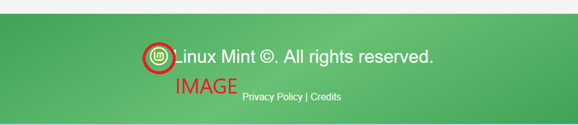

# Canvas, svg in img

V teji nalogi Linux Mint logo prikažem z različnimi metodami.

## Opis spletne strani z Linux Mint logotipom

Ta spletna stran je namenjena prikazu različnosti in fleksibilnosti uporabe Linux Mint logotipa. Na strani je logotip predstavljen v treh različnih oblikah:

- SVG: Logotip je vektorski, kar pomeni, da je prikazan v izjemno visoki kakovosti in je prilagodljiv velikosti brez izgube podrobnosti. SVG je še posebej uporaben za logotipe, saj zagotavlja ostrino na vseh napravah.
- Slikovni format (PNG): Logotip je predstavljen tudi kot običajna slika. To je pogosto uporabljena metoda za enostavno vključitev logotipov na spletne strani, vendar je velikost in kakovost slike omejena glede na izbrano ločljivost.
- Canvas: Logotip je narisan neposredno v HTML5 canvas elementu. Ta pristop prikazuje moč programskega risanja v brskalniku in omogoča prilagodljive interaktivne učinke.

Spletna stran vključuje minimalistično zasnovo, ki omogoča osredotočenje na vizualno predstavitev logotipa. Namen je prikazati, kako lahko isti logotip z različnimi tehnikami ustreza različnim potrebam in kontekstom uporabe.

## Slike spletne strani

## Avtor

Mitja Filej

